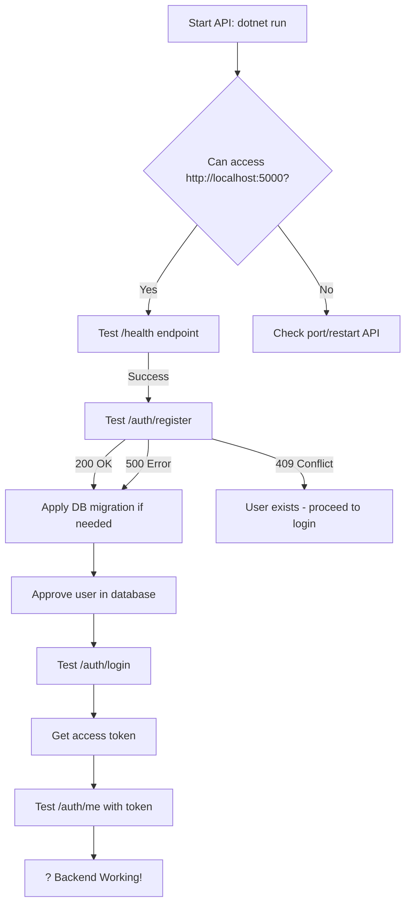

# ? API IS RUNNING - Here's What to Do

## Your Application IS Working!

When you see this output:
```
Now listening on: http://localhost:5102
Application started. Press Ctrl+C to shut down.
```

**This means the API is running successfully!** ?

---

## ?? What You Need to Do Now

### **Step 1: Access the API**

Open your web browser and go to:

```
http://localhost:5000
```

You should see the **Swagger UI** interface with all API endpoints!

---

### **Step 2: Test the API (Choose ONE)**

#### **Option A: Use PowerShell Script (Easiest)**

```powershell
# Make sure API is running first!
cd C:\Pavaman\config

# Run test script
.\test-api.ps1
```

This will:
- ? Test health endpoint
- ? Try to register a user
- ? Show you what to do next

---

#### **Option B: Use Swagger UI (Visual)**

1. Open browser to: `http://localhost:5000`
2. Find `POST /auth/register` endpoint
3. Click "Try it out"
4. Fill in the request body:
```json
{
  "fullName": "Admin User",
  "email": "admin@pavaman.com",
  "password": "Admin1234!",
  "confirmPassword": "Admin1234!",
  "organization": "Pavaman"
}
```
5. Click "Execute"
6. Check response

---

#### **Option C: Use curl**

```powershell
curl -X POST http://localhost:5000/auth/register `
  -H "Content-Type: application/json" `
  -d '{
    "fullName": "Admin User",
    "email": "admin@pavaman.com",
    "password": "Admin1234!",
    "confirmPassword": "Admin1234!"
  }'
```

---

### **Step 3: What Response to Expect**

#### ? **Success (200 OK):**
```json
{
  "success": true,
  "authStatus": "PendingApproval",
  "user": {
    "id": "...",
    "fullName": "Admin User",
    "email": "admin@pavaman.com",
    "isApproved": false
  }
}
```

**This is good!** User created, now needs approval.

---

#### ?? **Database Error (500):**
```
Database error / Cannot connect to PostgreSQL
```

**Solution:** You need to apply the migration first!

**From your local machine (with SSH tunnel):**

```powershell
# Terminal 1: Create SSH tunnel
ssh -i C:\path\to\key.pem -L 5432:drone-configurator-db.cxa0c8wu0du4.ap-south-1.rds.amazonaws.com:5432 ec2-user@YOUR_EC2_IP -N

# Terminal 2: Run migration
cd C:\Pavaman\config
dotnet ef database update --project PavamanDroneConfigurator.API --context ApiDbContext
```

**OR from EC2:**
```bash
cd ~/drone-config
git pull
dotnet ef database update --project PavamanDroneConfigurator.API --context ApiDbContext
```

---

#### ?? **User Already Exists (409 Conflict):**
```json
{
  "success": false,
  "errorMessage": "An account with this email already exists"
}
```

**This is okay!** Just use a different email or proceed to login.

---

## ?? Troubleshooting

### "Cannot access http://localhost:5000"

**Check if API is running:**
```powershell
# Should show the API process
netstat -ano | findstr :5000
```

**If nothing shows, start the API:**
```powershell
cd C:\Pavaman\config\PavamanDroneConfigurator.API
dotnet run
```

---

### "Port already in use"

**Kill the existing process:**
```powershell
# Find the process
netstat -ano | findstr :5000

# Kill it (replace <PID> with actual number)
taskkill /PID <PID> /F

# Start API again
dotnet run
```

---

### "Swagger page not loading"

**Try both URLs:**
- `http://localhost:5000` (HTTP)
- `http://localhost:5102` (alternate port)

**Check Program.cs has Swagger enabled:**
```csharp
if (app.Environment.IsDevelopment())
{
    app.UseSwagger();
    app.UseSwaggerUI(...);
}
```

---

## ?? Complete Testing Flow



---

## ? Quick Checklist

- [ ] API is running (`dotnet run`)
- [ ] Can access `http://localhost:5000`
- [ ] Swagger UI loads
- [ ] Health endpoint works (`/health`)
- [ ] Database migration applied
- [ ] Can register user (`/auth/register`)
- [ ] Can approve user in database
- [ ] Can login (`/auth/login`)
- [ ] Receive JWT token

---

## ?? Next: Test Full Auth Flow

Once the API is working:

1. **Run test script:**
   ```powershell
   .\test-api.ps1
   ```

2. **Approve user in database:**
   ```sql
   UPDATE users SET is_approved = true WHERE email = 'admin@pavaman.com';
   ```

3. **Test login:**
   ```powershell
   curl -X POST http://localhost:5000/auth/login `
     -H "Content-Type: application/json" `
     -d '{"email":"admin@pavaman.com","password":"Admin1234!","rememberMe":false}'
   ```

4. **Get access token** from response

5. **Test with frontend!**

---

## ?? More Help

- **API Testing:** See `API_TESTING_GUIDE.md`
- **Database Migration:** See `QUICK_START.md`
- **Full Deployment:** See `BACKEND_READY_GUIDE.md`

---

**Your API is working! Now test it!** ??

